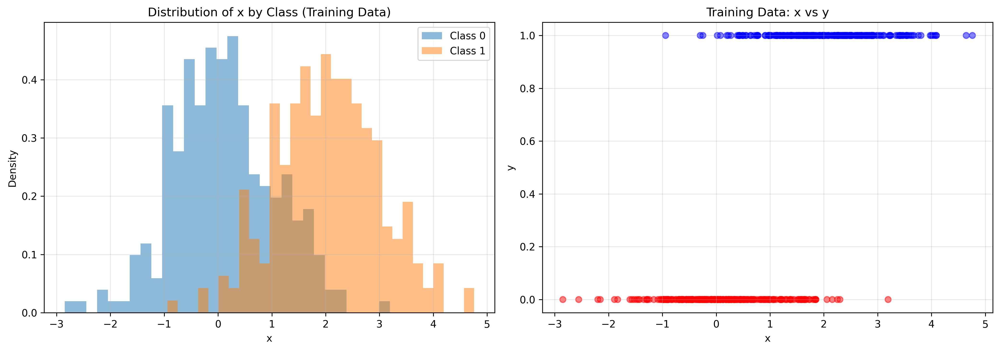
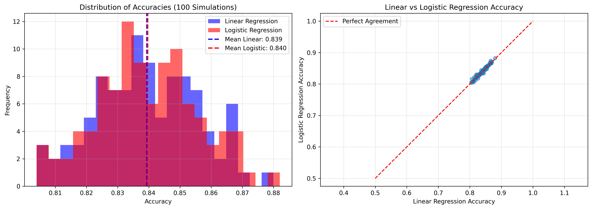
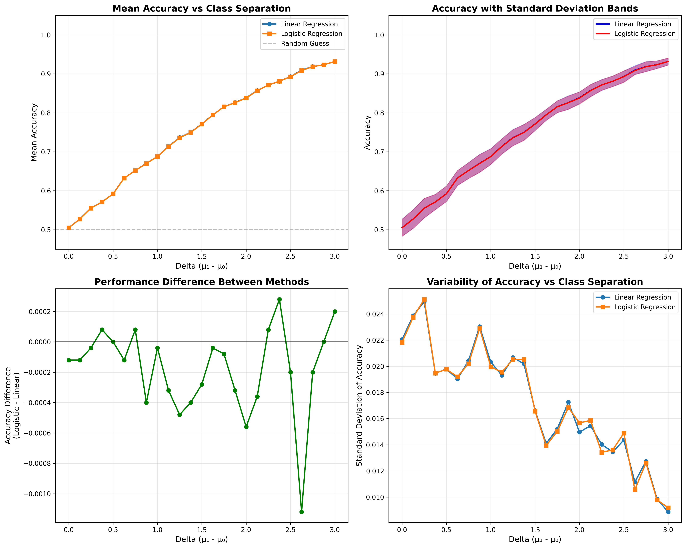

# Machine Learning Exercises
## Linear vs Logistic Regression Comparison

[](https://www.python.org/)
[](https://scikit-learn.org/)
[](LICENSE)

## 📚 Overview

This repository contains Python implementations of **Exercise 31.4** from the book [*Introduction to Data Science*](https://rafalab.dfci.harvard.edu/dsbook/) by Rafael Irizarry (Harvard University). 

The exercises compare the performance of **Linear Regression** and **Logistic Regression** for binary classification tasks with varying class separations.

## 🎯 Objectives

1. **Exercise 1**: Compare accuracy of linear and logistic regression on a single synthetic dataset
2. **Exercise 2**: Repeat the simulation 100 times to assess average performance
3. **Exercise 3**: Analyze how class separation (delta) affects model accuracy

## 📊 Key Findings

### Main Results:
- ✅ Linear and Logistic Regression perform **virtually identically** for simple 1D binary classification
- ✅ Average accuracy difference: **< 0.04%** across 100 simulations
- ✅ Both methods achieve ~50% accuracy when classes completely overlap (delta = 0)
- ✅ Both methods achieve ~93% accuracy when classes are well-separated (delta = 3)

### Performance by Class Separation:
| Delta (μ₁ - μ₀) | Linear Regression | Logistic Regression | Difference |
|-----------------|-------------------|---------------------|------------|
| 0.00            | 50.51%           | 50.50%             | -0.01%     |
| 1.50            | 77.14%           | 77.11%             | -0.03%     |
| 3.00            | 93.15%           | 93.17%             | +0.02%     |

## 🚀 Installation

### Prerequisites
```bash
python >= 3.8
numpy
pandas
matplotlib
seaborn
scikit-learn
```

### Install Dependencies
```bash
pip install numpy pandas matplotlib seaborn scikit-learn
```

## 💻 Usage

### Run All Exercises
```bash
python ml-classification-comparison.py
```

### Import as Module
```python
from ml-classification-comparison import make_data, compare_models

# Generate synthetic data
data = make_data(n=1000, mu_0=0, mu_1=2)

# Compare models
results = compare_models(data)
print(f"Linear Regression Accuracy: {results['linear']:.4f}")
print(f"Logistic Regression Accuracy: {results['logistic']:.4f}")
```


## 📈 Visualizations

### Exercise 1: Data Distribution


### Exercise 2: 100 Simulations


### Exercise 3: Accuracy vs Delta


## 🔬 Methodology

### Data Generation
```python
def make_data(n=1000, p=0.5, mu_0=0, mu_1=2, sigma_0=1, sigma_1=1):
    """
    Generate binary classification data from two normal distributions:
    - Class 0: N(μ₀, σ₀²)
    - Class 1: N(μ₁, σ₁²)
    """
```

### Model Comparison
1. **Linear Regression**: Predict y using linear model, threshold at 0.5
2. **Logistic Regression**: Standard logistic regression with sigmoid function

### Evaluation Metric
- **Accuracy**: Proportion of correct predictions on test set

## 📊 Statistical Analysis

### Exercise 2 Results (100 Simulations):
- **Linear Regression**: 83.94% ± 1.64%
- **Logistic Regression**: 83.96% ± 1.66%
- **Correlation**: r > 0.99 (nearly perfect agreement)

### Exercise 3 Results (25 Delta Values):
- **Total Simulations**: 1,250 (25 deltas × 50 repetitions)
- **Delta Range**: [0, 3] with 25 equally-spaced values
- **Key Observation**: Both methods show identical learning curves

## 🎓 Educational Insights

### Why Do They Perform Similarly?

1. **Simple 1D Problem**: With only one predictor, the decision boundary is simple
2. **Linear Separability**: Classes differ mainly in their means, making a linear boundary effective
3. **Balanced Classes**: Equal prior probabilities (p = 0.5) reduce bias issues
4. **Well-Specified Model**: The data-generating process aligns with model assumptions

### When Would They Differ?

- **Non-linear boundaries**: Logistic regression handles non-linearity better
- **Extreme probabilities**: Logistic regression naturally bounds predictions to [0,1]
- **Imbalanced data**: Logistic regression better handles class imbalance
- **Multiple predictors**: Differences emerge with complex feature interactions


## 📝 Notes

### Key Takeaways:
- For simple binary classification problems, linear and logistic regression often perform similarly
- Class separation (effect size) is the primary driver of model accuracy
- Both methods benefit equally from increased class separation
- The choice between methods should be based on interpretability and theoretical considerations rather than raw accuracy for simple problems

### Practical Implications:
- Always compare multiple models empirically
- Effect size matters more than model complexity for simple problems
- Consider computational efficiency when performance is equivalent


## 📜 License

This project is licensed under the MIT License - see the [LICENSE](LICENSE) file for details.

## 👤 Author

Created for educational purposes based on exercises from *Introduction to Data Science* by Rafael Irizarry.

## 🙏 Acknowledgments

- **Rafael Irizarry** - Original exercise design and theoretical framework
- **Harvard University** - Course materials and datasets
- **scikit-learn** - Machine learning library

## 📧 Contact

For questions or feedback, please open an issue on GitHub.

---

**Note**: This is an educational project. The exercises demonstrate fundamental concepts in machine learning model comparison and evaluation.
